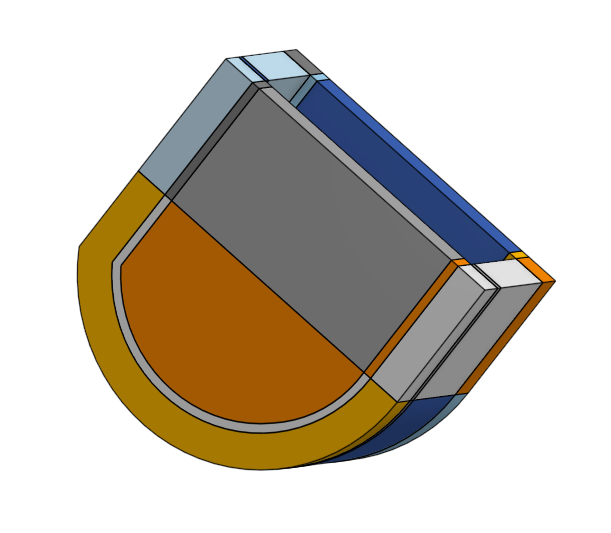

# Winter Project 2019: Hexapodal Gait

## Description

The aim of this project was (1) to design a modular walking algorithm for a six-legged machine, and (2) for that algorithm to produce a bio-inspired gait. Bio-inspired in this context refers to a gait without sharp deviations in its trajectory- an important quality that allows for real system to change direction at high speeds without requiring infinite torque.

In its current form, the hexapod has six directions (six gaits) with a variety tunable parameters. These will be discussed in the Software section.

# Hardware

The hexapod is primarily 3D-printed in Tough PLA, held together with metal fasteners.

## Vorpal Hexapod Framework

[Vorpal Robotics Homepage.](http://vorpalrobotics.com/wiki/index.php/Vorpal_Robotics "Vorpal Robotics Homepage")

The body and legs of this hexapod were developed by Vorpal Robotics, a group that originally developed the Vorpal Hexapod as a readily-available learning model funded on Kickstarter. Their models are open-source, and the community around Vorpal is rife with homebrew hexapods (this one included!).

The Vorpal Hexapod has an approximately cylindrical body used to house the electronic components. On this body are six hip slots, which hold one servo a piece. These servos are then connected to a two-piece swiveling 'thigh', which are in turn connected to the servo housing (the knee) of the leg.

The Vorpal Hexapod legs are curved, which allow for an increased degree of stability despite the lack of rigid hip and knee joints. To clarify, the joints at both the hip and knee are fastened to the servo on one side, but remain on floating as they swivel on the other. This compliance in the design can be useful for overcoming small deviations in terrain, but also necessitate extra caution when adding components to the hexapod (weight more readily becomes a limitation).

## Custom parts

Although the chassis and leg components designed by Vorpal Robotics, the internal scaffolding as well as the 'feet' of this hexapod were designed specifically for this project.

### Electronics Caddy

The electronics caddy (pictured above) has:
1. A slot to hold the Lithium Ion battery.
2. Mounting holes to secure the caddy to the chassis, as well as mounts for the Raspberry Pi beneath the overhanging slot.
3. A section in the middle to hold a permaboard, accessible to the wiring from the Raspberry Pi above and the servo hardware below (within the chassis).

### Grip Socks

The grip socks were printed out of NinjaFlex PLA, a pliable plastic that tends to print with a coarse grain. By placing these on the feet of each leg, this hexapod was able to generate a better grip, resulting in:
1. Longer feasible strides.
2. Less error in gait cycle due to the aforementioned 'half-floating joints' at the hip and knees.

## BOM

The bill of materials was influenced by the recommended components put forth by Vorpal Robotics and adapted to fit my needs. As follows:

### Battery

1. 4-AA Battery Pack
2. UBEC DC/DC Step-Down (Buck) Converter - 5V @ 3A output
3. DTP 605068 Lithium Ion Battery - 3.7 V; 2000 mAh

### Electronic

1. Raspberry Pi Zero W
2. LiPo 5 V SHIM
3. Adafruit 16-Channel PWM Driver

### Mechanical
1. TowerPro SG92R Servo (x12)
2. PS3 Controller

# Software

This project runs via a Raspberry Pi Zero W, and the files are executed from within a ROS workspace. Within the workspace, the scripts are written in Python (2).

Outside of the ROS workspace, a number of '1-off' helper scripts for diagnostics exist, which run Python (3). The control scheme used for input is a PS3 controller via Bluetooth, though scripts are included which work with a wired PS3 controller as well as with keyboard input.

## Gait Algorithm

The gait algorithm depends on four initial parameters (listed with their acceptable range):

**stridelength** [0:100]
1. The *stridelength* variable describes the angular sweep from the maximum to the minimum hip angle during one gait cycle.
2. This is essentially the 'width' of a gait pattern.

**kneestance** [20:50]
1. *kneestance* describes the value (in degrees) of the knee at stance.
2. Because of the curve in the foreleg, any angle lower than 20 will cross a 'bounce' point, which will destabilize the hexapod.
3. Any values larger than 50 will raise the foot from the ground, rendering the leg no longer 'in stance.'

**kneerise** [~60:210]
1. The *kneerise* variable is the angle (in degrees) that the knee will reach at it's maximum during a gait's rise cycle.
2. This value minus the kneestance degines the 'height' of a gait pattern.

**velocity** [0.02 minimum]
1. the *velocity* variable determines the frequency at which leg motions will occur. Since the PWM frequency for these servos is 50 Hz, 0.02 is our minimum for reliable motion input.

### Workspace

The above image shows an initial plot of the workspace of each leg. Each of the black wireframes represents a position of the leg.

And this image shows the topographical plot of that wireframe workspace. Note that the z-axis is a bit skewed in scale. Red regions indicates the full forward extension possible by one leg.

### Directionality

This hexapod is programmed to generate gaits in 6 directions (listed with their gait algorithm primitive):
1. Forward (Normal)
2. Backward (Normal)
3. Left (On-Angle)
4. Right (On-Angle)
5. Turn Left (Turning)
6. Turn Right (Turning)

### Forward vs. Reverse

### Normal Gait

### Turning Gait

### On-Angle Gait

Push vs. Pull

## Troubleshooting

### Force feedback
When using a PS3 controller over Bluetooth, *joy_nod* will not recognize the 'force feedback' (i.e. rumble) functionality of the PS3 controller afforded by *ps3joy*. This will not cause any issues with the control scheme, but the error will look something like:

### Socket
When running the launch file multiple times without resetting the Raspberry Pi Zero W, you will likely see the message below.

It is due to the PS3 controller not desyncing over Bluetooth with the Pi. Hold down the PS button on the controller and wait for ~10 seconds; there will be no verbose response in the terminal, but the controller will resync and work as expected.

# Sources
